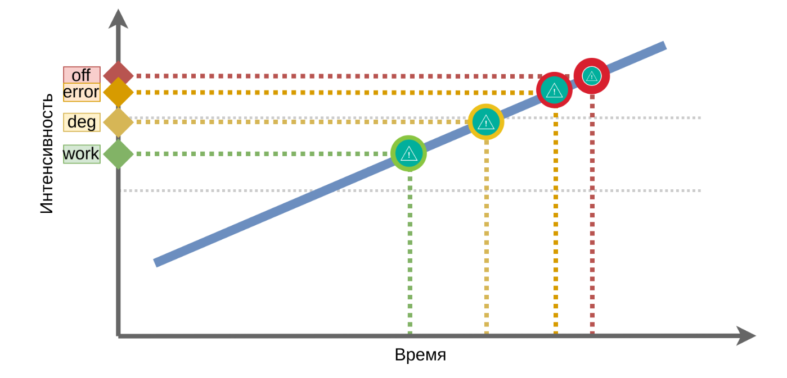

## <a name="contents"></a>Архитектура высоконагруженных систем
1. [Метрики качества](#metrics)
2. [Проблемы нагрузок](#problems)
3. [Тестирование производительности](#testing)
4. [Индексы](#indexes)

### <a name="metrics"></a> Метрики качества
#### Что мерять
- `rps`, `rpm` - количество запросов в единицу времени
- `pps` (packets per second), `mps` (megabytes ...) - количество данных в единицу времени
- `simultaneous connections`, `concurrency` - количество одновременных соединений
- `latency` - задержка ответа
- `throughput` - пропускная способность системы (в хайлоад жертвуют latency ради этого)

#### Как мерять
Статистические величины (95, 99) - перцентили

#### Виды масштабирования
- Вертикальное - увеличение мощности сервера
- Горизонтальное - использование большего количества серверов

 [ к оглавлению >>](#contents)
 
 ### <a name="problems"></a> Проблемы нагрузок
 #### Переключение контекста
 В операционных системах с планировщиком задач существует проблема переключения контекста
 между задачами и потоками, так как необходимо пройти несколько этапов
 - Сохранение регистров процессора
 - Сохранение общей информации pid, tid, uid, gid, euid, egid и т. д.
 - Сохранение состояния процесса/потока
 - Сохранение прав доступа
 - Сохранение используемых потоком ресурсов и блокировок
 - Сохранение счетчики использования ресурсов (например, таймеры использованного процессорного времени)
 - Сохранение регионов памяти, выделенных процессу
 - Очистка конвейера команд и данных процессора
 - Очистка TLB, отвечающий за страничное отображение линейных адресов на физические
 #### Процессы и потоки
 В системе linux процессы и потоки отличаются доступом к памяти. У потоков она общая
 - создание процесса
 ```shell script
      clone(
          child_stack=0, 
          ags=CLONE_CHILD_CLEARTID |
              CLONE_CHILD_SETTID |
              SIGCHLD, 
          child_tidptr=0x7fa001a93a10) = 6916
```
- создание потока
```shell script
    clone(
      child_stack=0,
      ags=CLONE_VM|
          CLONE_FS|
          CLONE_FILES|
          CLONE_SYSVSEM|
          CLONE_SIGHAND|
          CLONE_THREAD|
          CLONE_SETTLS|
          CLONE_PARENT_S
      child_tidptr=0x7fa001a93a10) = 6916
```
#### Модели Веб серверов
- worker (многопоточный)
- prefork (многопроцессный)
- синхронный (select)
- async (асинхронный epol)
- Комбинированные варианты

#### worker vs prefork
- переключение контекста между потоками менее затратное
- меньше потребление памяти
- потоки сложнее синхронизировать

####  Блокирующие и неблокирующие системные вызовы
Блокирующие системные вызовы блокируют процесс (или поток) до того, как будут получены данные (часть данных).
Во время блокировки процесс не потребляет процессорное время, но потребляет память.
Чтение из сети может быть неблокирующим. В неблокирующем режиме чтение из сокета возвращает или ответ (хотя
бы его часть), или сообщение, что данные еще не готовы.
Чтение с диска может быть только блокирующим(*)

- Apache - синхронный многопроцессный
- Nginx - асинхронный многопоточный

#### Концепция Fiber
- Асинхронный код - быстрый, потребляет мало памяти.
- Асинхронный код - сложно писать.
- Синхронный код - медленее, потребляет больше памяти.
- Синхронный код - просто писать.

#### Обзор языков программирования
- Perl
    - Обычно работает внутри apache.
    - Синхнронный язык с поддержкой тредов (редко).
    - Есть библиотека AnyEvent (еще реже тредов)
    - Есть библиотека для fiber
- Php
    - CLI SAPI - в качестве консольной команды php для запуска наших кронов и других cli-программ
(Command Line Interface)
    - apxs2 SAPI - в качестве модуля к apache2
    - CGI SAPI - в качестве запускаемого на каждом запросе CGI (сейчас так почти никто не делает)
    - FPM SAPI - Fast Process Manager, написанный для PHP разработчиками из комании Badoo и
теперь поддерживаемый сообществом
    - Можно делать потоки, но редко используется.

- Python
    - Есть потоки.
    - Есть fiber.
    - Процесс с потоками в Python может утилизировать только одно ядро процессора

 - Node.js
    - Асинхронный код.
    - Строго однопоточный.
    
- Go
    - Концепция зеленых тредов.
    - Умеет использовать столько ядер ЦПУ, сколько нужно.
    - Ориентирован на микросервисы.
    - Быстрый.
    
#### Трехзвенная архитектура
Frontend, Backend, Storage
- Задачи frontend (reverse proxy)
    - Терминировать ssl-соединения.
    - Обработка медленных клиентов.
    - Отдача статики.
    - Keep-Alive.
    - Кэширование.
    - Балансировка.
    - Роутинг по бэкендам
- Задачи backend
    - Бизнес-логика
    - Ожидание ответов от хранилищ
- Задачи хранилищ
- Хранение информации
- Быстрый поиск (индексы)
- Обеспечение транзакционности (ACID)

#### Библиография
- Node.js multithreading: What are Worker Threads and why do they matter? - LogRocket Blog
https://blog.logrocket.com/node-js-multithreading-what-are-worker-threads-and-why-do-they-matter-48ab102f8b10/

- Влияние Transparent Huge Pages на производительность системы
https://habr.com/ru/company/tinkoff/blog/446342/

- Is this explanation about VSS/RSS/PSS/USS accurate?
https://stackoverflow.com/questions/22372960/is-this-explanation-about-vss-rss-pss-uss-accurate

 [ к оглавлению >>](#contents)
 
### <a name="testing"></a> Тестирование производительности
#### Области 
- Администраторы, backend
    - Быстрые ответы сервера
    - Эффективное использование оборудования
- Проектировщики интерфейсов, Frontend, Android, iOs
    - Клиентская оптимизация, быстрая отрисовка
    - Энергоэффективность
- Аналитики
    - Удобство использования
    - Понятность бизнес-процесса, запоминаемость
#### Тестирование производительности
##### Подсисием серверов
- нагрузка на диск
    - fio - flexible i/o tester [https://github.com/axboe/fio](https://github.com/axboe/fio)
        - The following example benchmarks maximum write throughput:
        ```shell script
             fio --ioengine=sync --direct=0 \
             --fsync_on_close=1 --randrepeat=0 --nrfiles=1  --name=seqwrite --rw=write \
             --bs=1m --size=20G --end_fsync=1 --fallocate=none  --overwrite=0 --numjobs=1 \
             --directory=/mnt/gcfs --loops=10
        ```
        - The following example benchmarks maximum write IOPS:
        ```shell script
            fio --ioengine=sync --direct=0 \
            --fsync_on_close=1 --randrepeat=0 --nrfiles=1  --name=randwrite --rw=randwrite \
            --bs=4K --size=1G --end_fsync=1 --fallocate=none  --overwrite=0 --numjobs=80 \
            --sync=1 --directory=/mnt/standard --loops=10
        ```
- нагрузка на процессор
    - Phoronix [https://phoronix-test-suite.com/](https://phoronix-test-suite.com/)
        ```shell script
         phoronix-test-suite benchmark smallpt
             Test Results:
                 57.683207988739
                 57.237819910049
                 57.684161901474
             Average: 57.54 Seconds
       ```
- нагрузка на сеть
    - iperf3 [https://software.es.net/iperf/](https://software.es.net/iperf/)
        ```shell script
            iperf3 -s
            iperf3 -c 192.168.1.66
            [ ID] Interval           Transfer     Bandwidth       Retr
            [  4]   0.00-10.00  sec  42.9 GBytes  36.8 Gbits/sec    0             sender
            [  4]   0.00-10.00  sec  42.9 GBytes  36.8 Gbits/sec  
        ```
##### Cерверов приложений на простых запросах
- Подать нагрузку на балансировщик
    - `httpperf`, `ab`
- Подать нагрузку на сервер баз данных
    - `sysbench` (MySQL), `pgbench` (PostgreeSQL) 
- Подать нагрузку на сервер приложений
    - `curl`, `wget`, `ab`
    - на уровне TCP - `tcpreplay`
##### Приложений при выполнении сценариев
Производятся динамически связанные запросы к системе, связанные со сценариями пользовательской активности, с высокой интенсивностью
- Самописные утилиты "Бешенный пользователь"
- Функциональный тест без пауз в несколько потоков

##### В соответствии с требованиями
Производится точная нагрузка, в подходящее время, в нужном месте, с нужной силой, с анализом происходящего
- Appache.JMeter - простые сценарии (Groovy, Java, JavaScript)
- Gatling - сложные сценарии с десятками зпросов (Scala)
- wrk - автоматизация на Lua
- Yandex.Tank - единый отчет, масштабирование (Go, Pyhon)


#### Валидация результатов
- Смоделировать нагрузку
- Отладить мониторинг (для сравнения результатов теста с показателями мониторинга систем)
  - `TIG` - Telegraph, InfluxDB, Grafana
  - `Prometheus` - Telegraf, Prometheus, Grafana
  - `Zabbix` - Zabbix, Grafana. 
- Сравнить со стандартами для оборудования
#### Виды тестиования производительности


- Нагрузочное (load testing) - выполнение программы с повышением нагрузки от среднего профиля до максимального и выше
    - подаем нагрузку ступенями, наращиваем количество операций в единицу времени ( выдержит ли система нагрузку, есть ли узкие места)
    
    - выше максимума, чтобы знать есть ли запас
    
    - ищем точку деградации и доступности (timeout, 504)
    
    - сравниваем с профилем нагрузки (min, med, max)
    
    - ищем узкое место, лимиты, в.т.ч конфигурационные
    
    - необходимо понимание работы системы
    
    - ищем точку появления ошибок под нагрузкой
    
    - стараемся избавиться от ошибок и предупреждений
    
    - их их отношения к профилю нагрузки (med, max)
    
    - выбираем профиль для теста стабильности (80% от точки деградации)
    
    
- Стабильности (stability testing) - длительное тестирование со средней нагрузкой, поиском отклонений и проверками корректности работы 
(что будет при эксплуатации 24/7, стабильна ли система под нагрузкой, как быстро растет размер базы данных, есть ли утечка соединений,
нет ли потерь данных)
    - не выше предельной, чтобы не было ошибок
    
    -  всю ночь или все выходные
    
    - выполняются во время или между интерациями
    
    - попадут в отчет по тестированию стабильности
    
    
   
- Стрессовое (stress testing) - тестирование за пределами рабочих нагрузок в ограниченных ресурсах (если нагрузка ненадолго превысит максимум,
освобождаются ли неиспользуемые ресурсы, восстановится ли система после ошибок, какие ошибки проявляются под нагрузкой)
    - быстро и ненадолго повысим нагрузку и повторим такой процесс несколько раз
    
    - Выявим утечку ресурсов, проверим корректность обработки исключений
    
    - выявим утечку ресурсов, возможно, что ресурсы не освобождаются полностью
    
    - возможно, что ресурсы не освобождаются частично
    
    - быстро ли разбираются внутренние очереди системы
    
    
- Обьемное (volume testing) - тестирование при увеличении обьемов данных (что будет через 5 лет работы, а если увеличить размер документов)
    - сценарий через 1 год работы
    
    - сценнарий через 5 лет работы
    
    - сценарий через 10 лет работы
    
    > - нужен генератор баз данных и лучше его писать на SQL
    - профиль нагрузки - размер пакета данных
                                                                                                                                                                                                                                                                                                           >

- Масштабируемости (scalability testing) - серия нагрузочных тестов для разных профилей оборудования, количества серверов или узлов системы,
настроек - размеров очередей, лимитов (поможет ли увеличение памяти в 2 раза, какой предел на другом железе, какая производительность
на двух серверах)
    - Наращивание мощьности оборудования вертикальное масштабирование
    
    - Тестирование на разных конфигурациях для прогноза затрат
    
    - Наращивание мощьности оборудования имеет технический предел
    
    - Наращивание количества узлов горизонтальное масштабирование
    
    - Наращивание количества узлов закладывается в архитектуру
    
    - Наращивание количества узлов - дает гибкость
    

#### Генерация данных
- Лучше всего использовать SQL для генерации данных
    - высокая скорость генерации
    - можно сгенерировать 100Гбайт
    - не нужны интеграции
    - SQL - может многое
- API - гибкость и надежность
    - генерация на активной системе
    - быстрый отклик по корректировке
    
[ к оглавлению >>](#contents)

### <a name="indexes"></a> Индексы
Большинство проблем с производительностью баз данных решается индексами
- Ускоряют запросы
- Позволяют делать constaints (UNIQUE, FOREIGN KEY)
##### Виды индексов
- BTREE
- RTREE
- Hash
- FULLTEXT

#### BTREE

- умеет
    - Поиск по равенству (а=5)
    - Поиск по открытым диапазонам (а > 5 b a < 3)
    - Поиск по закрытому диапазону ( 2 < f < 8)
- не умеет
    - Искать четные числа
    - Искать суффиксы
    
- для строк те же правила (Like то же работает с индексами)
    - хорошо `LIKE "a%"`, плохо `LIKE "%c"`
### Типы индексов Mysql
- InnoDB - указателем на данные для вторичного ключа будет значение первичного ключа (у любого индекса есть скрытый элемент индекса)
- MyIsam - указателем на данные для ключа будет физическое смещение в файле
#### Особенности
- Могут быть многоколоночными key(a,b,c)
    - сравниваются по элементам массива
- Индексы дорогая штука 
    - при записи данных происходит обновление индексов
    - при чтении приходится анализировать больше индексов
- Кластерный ключ - InnoDB - создает скрытый кластерный ключ, из PRIMARY_KEY или UNIQUE_KEY или создает самостоятельно
    - если правильно задавать кластерный ключ,то можно достичь высокой степени локализации записей ( 
    к примеру идентификатор комментария к посту, является конкатенацией идентификатора поста и своей части) это позволяет достичь хранения всех комменатиев
    рядом друг с другом, что ускоряет чтение
    
#### Зачем используются индексы
- Поиск данных
- Сортировка
- Избежание чтения из таблицы (покрывающие индексы - covering indexes)
- Специальные оптимизации

```sql
   USE db;
 
   CREATE TABLE tbl (
           id bigint(20) NOT NULL AUTO_INCREMENT,
           a bigint(20) NOT NULL,
           b bigint(20) NOT NULL,
           c bigint(20) NOT NULL,
           d bigint(20) NOT NULL,
           e bigint(20) NOT NULL,
           str VARCHAR(54) NOT NULL,
           PRIMARY KEY (id)
       ) ENGINE=InnoDB DEFAULT CHARSET=utf8
```

- контейнер - data/docker-compose.yml
- данные - mock-generate.py

#### Создание индекса

- `EXPLAIN SELECT a, b from tbl where a = 1;`
- type: all - полное сканирование
```
    +----+-------------+-------+------------+------+---------------+------+---------+------+-------+----------+-------------+
    | id | select_type | table | partitions | type | possible_keys | key  | key_len | ref  | rows  | filtered | Extra       |
    +----+-------------+-------+------------+------+---------------+------+---------+------+-------+----------+-------------+
    |  1 | SIMPLE      | tbl   | NULL       | ALL  | NULL          | NULL | NULL    | NULL | 21460 |    10.00 | Using where |
    +----+-------------+-------+------------+------+---------------+------+---------+------+-------+----------+-------------+
```
- создаем индекс `CREATE INDEX a ON tbl(a);`
- `EXPLAIN SELECT a, b from tbl where a = 1;`
```shell script
    +----+-------------+-------+------------+------+---------------+------+---------+-------+-------+----------+-------+
    | id | select_type | table | partitions | type | possible_keys | key  | key_len | ref   | rows  | filtered | Extra |
    +----+-------------+-------+------------+------+---------------+------+---------+-------+-------+----------+-------+
    |  1 | SIMPLE      | tbl   | NULL       | ref  | a             | a    | 8       | const | 10730 |   100.00 | NULL  |
    +----+-------------+-------+------------+------+---------------+------+---------+-------+-------+----------+-------+
```
- type: ref

#### Покрывающий индекс
- `EXPLAIN SELECT a from tbl where a = 1;`
- Extra: Using index - все данные берутся из индекса

```shell script
    +----+-------------+-------+------------+------+---------------+------+---------+-------+-------+----------+-------------+
    | id | select_type | table | partitions | type | possible_keys | key  | key_len | ref   | rows  | filtered | Extra       |
    +----+-------------+-------+------------+------+---------------+------+---------+-------+-------+----------+-------------+
    |  1 | SIMPLE      | tbl   | NULL       | ref  | a             | a    | 8       | const | 10730 |   100.00 | Using index |
    +----+-------------+-------+------------+------+---------------+------+---------+-------+-------+----------+-------------+
```

#### Запрос с префиксами

- `EXPLAIN SELECT  a, b from tbl where a = 1 and b = 3`
- запрос по индеску а, с дополнительным сканированием по b
```shell script
    +----+-------------+-------+------------+------+---------------+------+---------+-------+-------+----------+-------------+
    | id | select_type | table | partitions | type | possible_keys | key  | key_len | ref   | rows  | filtered | Extra       |
    +----+-------------+-------+------------+------+---------------+------+---------+-------+-------+----------+-------------+
    |  1 | SIMPLE      | tbl   | NULL       | ref  | a             | a    | 8       | const | 10730 |    10.00 | Using where |
    +----+-------------+-------+------------+------+---------------+------+---------+-------+-------+----------+-------------+

```

- `CREATE INDEX a_b ON tbl(a,b);`
- `EXPLAIN SELECT  a, b from tbl where a = 1 and b = 3`
- составной индекс и запрос по соответствующим ключам позволяет получать данные покрывающим индексом
```shell script
    +----+-------------+-------+------------+------+---------------+------+---------+-------------+------+----------+-------------+
    | id | select_type | table | partitions | type | possible_keys | key  | key_len | ref         | rows | filtered | Extra       |
    +----+-------------+-------+------------+------+---------------+------+---------+-------------+------+----------+-------------+
    |  1 | SIMPLE      | tbl   | NULL       | ref  | a_b           | a_b  | 16      | const,const | 1000 |   100.00 | Using index |
    +----+-------------+-------+------------+------+---------------+------+---------+-------------+------+----------+-------------+
```

#### Когда индекс применим
- `CREATE INDEX a_b_c ON tbl(a,b,c)`
- Хорошие запросы
    - where a = 0
    - where a > 0
    - where a = 0 and b > 4
    - where a = 0 and b = 2
    - where a = 0 and b = 2 and c > 2
    - where a = 0 and b in (2,4) and c > 3
- Плохие запросы (индекс не работает,так как префикс а не используется)  
    - where b > 3
    - where b = 6
    - where b = 2
- Частичное использование - префикс индекса работает с лева на право, до первого условия неравенства включительно
    - a > 0 and b = 4
    - a = 0 and b < 3 and c = 3
    - a = 0 and b > 3 and c < 3
    
#### Индексы для сортировки

 - Хороший запрос
    - SELECT * FROM tbl ORDER BY a LIMIT 10
    - SELECT * FROM tbl WHERE a = 1 ORDER BY b LIMIT 10
    - SELECT * FROM tbl WHERE a > 1 ORDER BY a LIMIT 10 - те же правила к сортировке что и к неравенству (это же сравнение)
    - SELECT * FROM tbl ORDER BY a DESC, b DESC LIMIT 10 - сортировка должна быть однонаправленной
    - SELECT * FROM tbl ORDER BY a ASC, b ASC LIMIT 10
- Плохие запросы
    - SELECT * FROM tbl ORDER BY b LIMIT 10
    - SELECT * FROM tbl WHERE a > 1 ORDER BY b LIMIT 10
    - SELECT * FROM tbl WHERE a in (1,2,3) ORDER BY b LIMIT 10 - в сортировке in не работает!!!
    - SELECT * FROM tbl ORDER BY a ASC, d DESC LIMIT 10 - в новых версиях появились разнонаправленные индексы
    
#### Оптимизация агрегирующих функций
- min и max - очень быстро работают по индексам, другие функции не ускоряются
- CREATE INDEX a_str ON tbl(a, str)
- SELECT a, max(str) from tbl GROUP BY a

#### Оптимизация JOIN 
- В MySQL используется метод nested loops, но с оптимизациями
- JOIN должны быть по индексам
```shell script
    SELECT * FROM posts WHERE author='Peter'
    JOIN comments ON posts.id = comments.post_id
```
- Индекс по post_id - бесполезен
- Индекс по comments.post_id - необходим

#### Index Merge
- OR это плохая конструкция в запросе
- Можно использовать два индекса, вместо составного

 #### Префиксные индексы
 - можно составить индекс по префиксу строки, важна селективность
 
 ##### Хаки
- between
    - нельзя - `SELECT * FROM tbl WHERE a BETWEEN 0 AND 5 AND b = 5`
    - можно `SELECT * FROM tbl WHERE a IN (0,1,2,3,4,5)  AND b = 5`
- фейковые фильтры - если надо использовать одно значение из составного индекса, можно включить весь первый
    -  SELECT * from tbl WHERE gender in('m', 'f') and city = 'Moscow' (index - gender_city)
- сортировка
    - нельзя `SELECT * FROM tbl WHERE a IN(0,1) ORDER BY b LIMIT 10`
    - можно 
    ```
        (SELECT * FROM tbl WHERE a = 0 ORDER BY b LIMIT 10)
        UNION ALL
        (SELECT * FROM tbl WHERE a = 1 ORDER BY b LIMIT 10)
        ORDER BY b LIMIT 10
    ```               
    [ к оглавлению >>](#contents)
