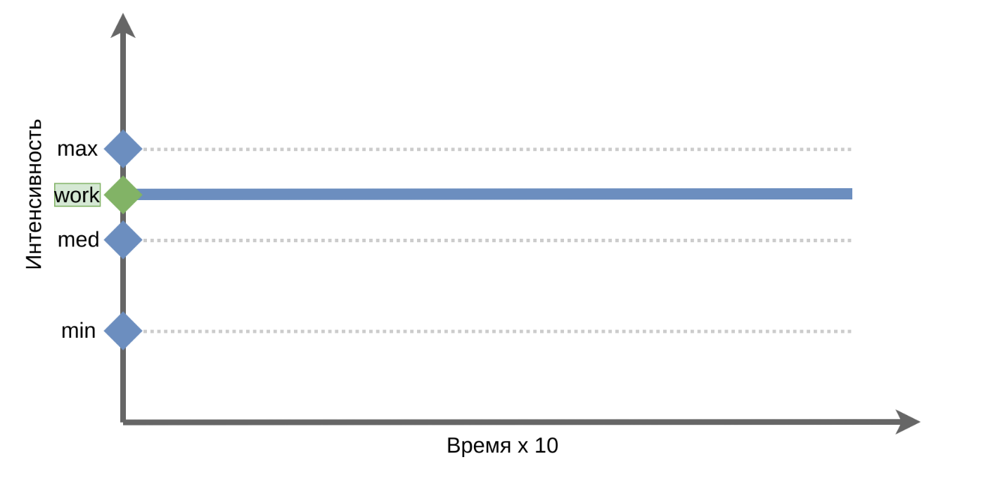
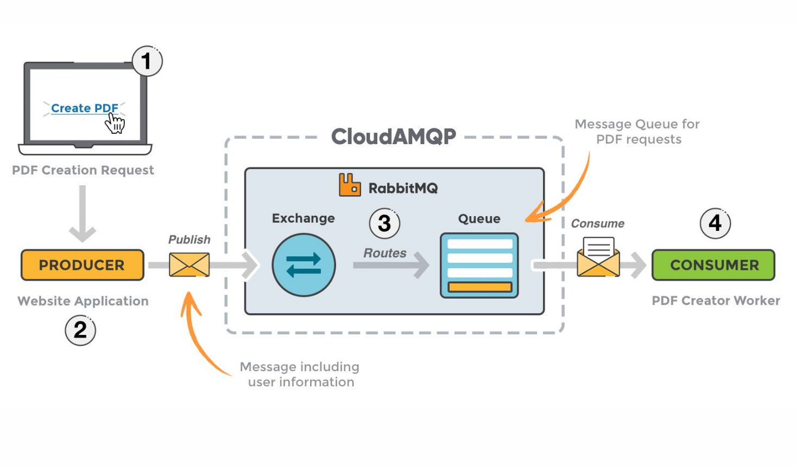
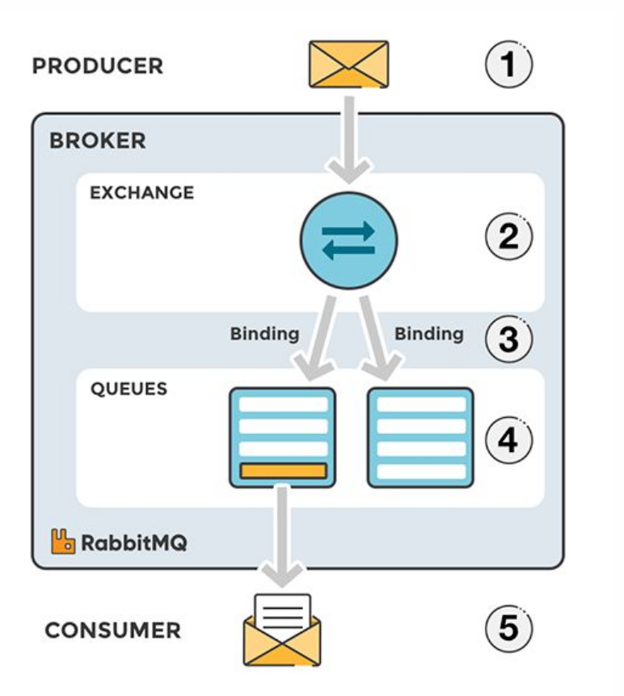
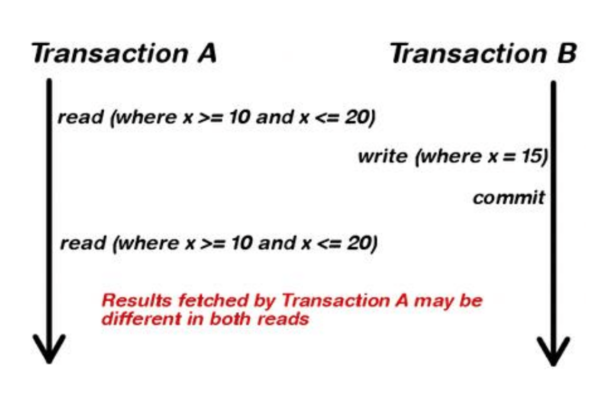

## <a name="contents"></a>Архитектура высоконагруженных систем
1. [Метрики качества](#metrics)
2. [Проблемы нагрузок](#problems)
3. [Тестирование производительности](#testing)
4. [Индексы](#indexes)
5. [Репликация](#replication)
6. [Шардирование](#sharding)
    - 6.1 [Общее](#sharding-common)
    - 6.2 [Vitess.io](#sharding-vitess)
7. [Кеширование](#caching)
9. [Брокеры сообщений](#message-broker)
10. [Транзакции в РСУБД](#transactions)

### <a name="metrics"></a> Метрики качества
#### Что мерять
- `rps`, `rpm` - количество запросов в единицу времени
- `pps` (packets per second), `mps` (megabytes ...) - количество данных в единицу времени
- `simultaneous connections`, `concurrency` - количество одновременных соединений
- `latency` - задержка ответа
- `throughput` - пропускная способность системы (в хайлоад жертвуют latency ради этого)

#### Как мерять
Статистические величины (95, 99) - перцентили

#### Виды масштабирования
- Вертикальное - увеличение мощности сервера
- Горизонтальное - использование большего количества серверов

 [ к оглавлению >>](#contents)
 
 ### <a name="problems"></a> Проблемы нагрузок
 #### Переключение контекста
 В операционных системах с планировщиком задач существует проблема переключения контекста
 между задачами и потоками, так как необходимо пройти несколько этапов
 - Сохранение регистров процессора
 - Сохранение общей информации pid, tid, uid, gid, euid, egid и т. д.
 - Сохранение состояния процесса/потока
 - Сохранение прав доступа
 - Сохранение используемых потоком ресурсов и блокировок
 - Сохранение счетчики использования ресурсов (например, таймеры использованного процессорного времени)
 - Сохранение регионов памяти, выделенных процессу
 - Очистка конвейера команд и данных процессора
 - Очистка TLB, отвечающий за страничное отображение линейных адресов на физические
 #### Процессы и потоки
 В системе linux процессы и потоки отличаются доступом к памяти. У потоков она общая
 - создание процесса
 ```shell script
      clone(
          child_stack=0, 
          ags=CLONE_CHILD_CLEARTID |
              CLONE_CHILD_SETTID |
              SIGCHLD, 
          child_tidptr=0x7fa001a93a10) = 6916
```
- создание потока
```shell script
    clone(
      child_stack=0,
      ags=CLONE_VM|
          CLONE_FS|
          CLONE_FILES|
          CLONE_SYSVSEM|
          CLONE_SIGHAND|
          CLONE_THREAD|
          CLONE_SETTLS|
          CLONE_PARENT_S
      child_tidptr=0x7fa001a93a10) = 6916
```
#### Модели Веб серверов
- worker (многопоточный)
- prefork (многопроцессный)
- синхронный (select)
- async (асинхронный epol)
- Комбинированные варианты

#### worker vs prefork
- переключение контекста между потоками менее затратное
- меньше потребление памяти
- потоки сложнее синхронизировать

####  Блокирующие и неблокирующие системные вызовы
Блокирующие системные вызовы блокируют процесс (или поток) до того, как будут получены данные (часть данных).
Во время блокировки процесс не потребляет процессорное время, но потребляет память.
Чтение из сети может быть неблокирующим. В неблокирующем режиме чтение из сокета возвращает или ответ (хотя
бы его часть), или сообщение, что данные еще не готовы.
Чтение с диска может быть только блокирующим(*)

- Apache - синхронный многопроцессный
- Nginx - асинхронный многопоточный

#### Концепция Fiber
- Асинхронный код - быстрый, потребляет мало памяти.
- Асинхронный код - сложно писать.
- Синхронный код - медленее, потребляет больше памяти.
- Синхронный код - просто писать.

#### Обзор языков программирования
- Perl
    - Обычно работает внутри apache.
    - Синхнронный язык с поддержкой тредов (редко).
    - Есть библиотека AnyEvent (еще реже тредов)
    - Есть библиотека для fiber
- Php
    - CLI SAPI - в качестве консольной команды php для запуска наших кронов и других cli-программ
(Command Line Interface)
    - apxs2 SAPI - в качестве модуля к apache2
    - CGI SAPI - в качестве запускаемого на каждом запросе CGI (сейчас так почти никто не делает)
    - FPM SAPI - Fast Process Manager, написанный для PHP разработчиками из комании Badoo и
теперь поддерживаемый сообществом
    - Можно делать потоки, но редко используется.

- Python
    - Есть потоки.
    - Есть fiber.
    - Процесс с потоками в Python может утилизировать только одно ядро процессора

 - Node.js
    - Асинхронный код.
    - Строго однопоточный.
    
- Go
    - Концепция зеленых тредов.
    - Умеет использовать столько ядер ЦПУ, сколько нужно.
    - Ориентирован на микросервисы.
    - Быстрый.
    
#### Трехзвенная архитектура
Frontend, Backend, Storage
- Задачи frontend (reverse proxy)
    - Терминировать ssl-соединения.
    - Обработка медленных клиентов.
    - Отдача статики.
    - Keep-Alive.
    - Кэширование.
    - Балансировка.
    - Роутинг по бэкендам
- Задачи backend
    - Бизнес-логика
    - Ожидание ответов от хранилищ
- Задачи хранилищ
- Хранение информации
- Быстрый поиск (индексы)
- Обеспечение транзакционности (ACID)

#### Библиография
- Node.js multithreading: What are Worker Threads and why do they matter? - LogRocket Blog
https://blog.logrocket.com/node-js-multithreading-what-are-worker-threads-and-why-do-they-matter-48ab102f8b10/

- Влияние Transparent Huge Pages на производительность системы
https://habr.com/ru/company/tinkoff/blog/446342/

- Is this explanation about VSS/RSS/PSS/USS accurate?
https://stackoverflow.com/questions/22372960/is-this-explanation-about-vss-rss-pss-uss-accurate

 [ к оглавлению >>](#contents)
 
### <a name="testing"></a> Тестирование производительности
#### Области 
- Администраторы, backend
    - Быстрые ответы сервера
    - Эффективное использование оборудования
- Проектировщики интерфейсов, Frontend, Android, iOs
    - Клиентская оптимизация, быстрая отрисовка
    - Энергоэффективность
- Аналитики
    - Удобство использования
    - Понятность бизнес-процесса, запоминаемость
#### Тестирование производительности
##### Подсисием серверов
- нагрузка на диск
    - fio - flexible i/o tester [https://github.com/axboe/fio](https://github.com/axboe/fio)
        - The following example benchmarks maximum write throughput:
        ```shell script
             fio --ioengine=sync --direct=0 \
             --fsync_on_close=1 --randrepeat=0 --nrfiles=1  --name=seqwrite --rw=write \
             --bs=1m --size=20G --end_fsync=1 --fallocate=none  --overwrite=0 --numjobs=1 \
             --directory=/mnt/gcfs --loops=10
        ```
        - The following example benchmarks maximum write IOPS:
        ```shell script
            fio --ioengine=sync --direct=0 \
            --fsync_on_close=1 --randrepeat=0 --nrfiles=1  --name=randwrite --rw=randwrite \
            --bs=4K --size=1G --end_fsync=1 --fallocate=none  --overwrite=0 --numjobs=80 \
            --sync=1 --directory=/mnt/standard --loops=10
        ```
- нагрузка на процессор
    - Phoronix [https://phoronix-test-suite.com/](https://phoronix-test-suite.com/)
        ```shell script
         phoronix-test-suite benchmark smallpt
             Test Results:
                 57.683207988739
                 57.237819910049
                 57.684161901474
             Average: 57.54 Seconds
       ```
- нагрузка на сеть
    - iperf3 [https://software.es.net/iperf/](https://software.es.net/iperf/)
        ```shell script
            iperf3 -s
            iperf3 -c 192.168.1.66
            [ ID] Interval           Transfer     Bandwidth       Retr
            [  4]   0.00-10.00  sec  42.9 GBytes  36.8 Gbits/sec    0             sender
            [  4]   0.00-10.00  sec  42.9 GBytes  36.8 Gbits/sec  
        ```
##### Cерверов приложений на простых запросах
- Подать нагрузку на балансировщик
    - `httpperf`, `ab`
- Подать нагрузку на сервер баз данных
    - `sysbench` (MySQL), `pgbench` (PostgreeSQL) 
- Подать нагрузку на сервер приложений
    - `curl`, `wget`, `ab`
    - на уровне TCP - `tcpreplay`
##### Приложений при выполнении сценариев
Производятся динамически связанные запросы к системе, связанные со сценариями пользовательской активности, с высокой интенсивностью
- Самописные утилиты "Бешенный пользователь"
- Функциональный тест без пауз в несколько потоков

##### В соответствии с требованиями
Производится точная нагрузка, в подходящее время, в нужном месте, с нужной силой, с анализом происходящего
- Appache.JMeter - простые сценарии (Groovy, Java, JavaScript)
- Gatling - сложные сценарии с десятками зпросов (Scala)
- wrk - автоматизация на Lua
- Yandex.Tank - единый отчет, масштабирование (Go, Pyhon)


#### Валидация результатов
- Смоделировать нагрузку
- Отладить мониторинг (для сравнения результатов теста с показателями мониторинга систем)
  - `TIG` - Telegraph, InfluxDB, Grafana
  - `Prometheus` - Telegraf, Prometheus, Grafana
  - `Zabbix` - Zabbix, Grafana. 
- Сравнить со стандартами для оборудования
#### Виды тестиования производительности


- Нагрузочное (load testing) - выполнение программы с повышением нагрузки от среднего профиля до максимального и выше
    - подаем нагрузку ступенями, наращиваем количество операций в единицу времени ( выдержит ли система нагрузку, есть ли узкие места)
    
    - выше максимума, чтобы знать есть ли запас
    
    - ищем точку деградации и доступности (timeout, 504)
    
    - сравниваем с профилем нагрузки (min, med, max)
    
    - ищем узкое место, лимиты, в.т.ч конфигурационные
    
    - необходимо понимание работы системы
    
    - ищем точку появления ошибок под нагрузкой
    
    - стараемся избавиться от ошибок и предупреждений
    
    - их их отношения к профилю нагрузки (med, max)
    
    - выбираем профиль для теста стабильности (80% от точки деградации)
    
    
- Стабильности (stability testing) - длительное тестирование со средней нагрузкой, поиском отклонений и проверками корректности работы 
(что будет при эксплуатации 24/7, стабильна ли система под нагрузкой, как быстро растет размер базы данных, есть ли утечка соединений,
нет ли потерь данных)
    - не выше предельной, чтобы не было ошибок
    
    -  всю ночь или все выходные
    
    - выполняются во время или между интерациями
    
    - попадут в отчет по тестированию стабильности
    
    
   
- Стрессовое (stress testing) - тестирование за пределами рабочих нагрузок в ограниченных ресурсах (если нагрузка ненадолго превысит максимум,
освобождаются ли неиспользуемые ресурсы, восстановится ли система после ошибок, какие ошибки проявляются под нагрузкой)
    - быстро и ненадолго повысим нагрузку и повторим такой процесс несколько раз
    
    - Выявим утечку ресурсов, проверим корректность обработки исключений
    
    - выявим утечку ресурсов, возможно, что ресурсы не освобождаются полностью
    
    - возможно, что ресурсы не освобождаются частично
    
    - быстро ли разбираются внутренние очереди системы
    
    
- Обьемное (volume testing) - тестирование при увеличении обьемов данных (что будет через 5 лет работы, а если увеличить размер документов)
    - сценарий через 1 год работы
    
    - сценнарий через 5 лет работы
    
    - сценарий через 10 лет работы
    
    > - нужен генератор баз данных и лучше его писать на SQL
    - профиль нагрузки - размер пакета данных
                                                                                                                                                                                                                                                                                                           >

- Масштабируемости (scalability testing) - серия нагрузочных тестов для разных профилей оборудования, количества серверов или узлов системы,
настроек - размеров очередей, лимитов (поможет ли увеличение памяти в 2 раза, какой предел на другом железе, какая производительность
на двух серверах)
    - Наращивание мощьности оборудования вертикальное масштабирование
    
    - Тестирование на разных конфигурациях для прогноза затрат
    
    - Наращивание мощьности оборудования имеет технический предел
    
    - Наращивание количества узлов горизонтальное масштабирование
    
    - Наращивание количества узлов закладывается в архитектуру
    
    - Наращивание количества узлов - дает гибкость
    

#### Генерация данных
- Лучше всего использовать SQL для генерации данных
    - высокая скорость генерации
    - можно сгенерировать 100Гбайт
    - не нужны интеграции
    - SQL - может многое
- API - гибкость и надежность
    - генерация на активной системе
    - быстрый отклик по корректировке
    
[ к оглавлению >>](#contents)

### <a name="indexes"></a> Индексы
Большинство проблем с производительностью баз данных решается индексами
- Ускоряют запросы
- Позволяют делать constaints (UNIQUE, FOREIGN KEY)
##### Виды индексов
- BTREE
- RTREE
- Hash
- FULLTEXT

#### BTREE

- умеет
    - Поиск по равенству (а=5)
    - Поиск по открытым диапазонам (а > 5 b a < 3)
    - Поиск по закрытому диапазону ( 2 < f < 8)
- не умеет
    - Искать четные числа
    - Искать суффиксы
    
- для строк те же правила (Like то же работает с индексами)
    - хорошо `LIKE "a%"`, плохо `LIKE "%c"`
### Типы индексов Mysql
- InnoDB - указателем на данные для вторичного ключа будет значение первичного ключа (у любого индекса есть скрытый элемент индекса)
- MyIsam - указателем на данные для ключа будет физическое смещение в файле
#### Особенности
- Могут быть многоколоночными key(a,b,c)
    - сравниваются по элементам массива
- Индексы дорогая штука 
    - при записи данных происходит обновление индексов
    - при чтении приходится анализировать больше индексов
- Кластерный ключ - InnoDB - создает скрытый кластерный ключ, из PRIMARY_KEY или UNIQUE_KEY или создает самостоятельно
    - если правильно задавать кластерный ключ,то можно достичь высокой степени локализации записей ( 
    к примеру идентификатор комментария к посту, является конкатенацией идентификатора поста и своей части) это позволяет достичь хранения всех комменатиев
    рядом друг с другом, что ускоряет чтение
    
#### Зачем используются индексы
- Поиск данных
- Сортировка
- Избежание чтения из таблицы (покрывающие индексы - covering indexes)
- Специальные оптимизации

```sql
   USE db;
 
   CREATE TABLE tbl (
           id bigint(20) NOT NULL AUTO_INCREMENT,
           a bigint(20) NOT NULL,
           b bigint(20) NOT NULL,
           c bigint(20) NOT NULL,
           d bigint(20) NOT NULL,
           e bigint(20) NOT NULL,
           str VARCHAR(54) NOT NULL,
           PRIMARY KEY (id)
       ) ENGINE=InnoDB DEFAULT CHARSET=utf8
```

- контейнер - data/docker-compose.yml
- данные - mock-generate.py

#### Создание индекса

- `EXPLAIN SELECT a, b from tbl where a = 1;`
- type: all - полное сканирование
```
    +----+-------------+-------+------------+------+---------------+------+---------+------+-------+----------+-------------+
    | id | select_type | table | partitions | type | possible_keys | key  | key_len | ref  | rows  | filtered | Extra       |
    +----+-------------+-------+------------+------+---------------+------+---------+------+-------+----------+-------------+
    |  1 | SIMPLE      | tbl   | NULL       | ALL  | NULL          | NULL | NULL    | NULL | 21460 |    10.00 | Using where |
    +----+-------------+-------+------------+------+---------------+------+---------+------+-------+----------+-------------+
```
- создаем индекс `CREATE INDEX a ON tbl(a);`
- `EXPLAIN SELECT a, b from tbl where a = 1;`
```shell script
    +----+-------------+-------+------------+------+---------------+------+---------+-------+-------+----------+-------+
    | id | select_type | table | partitions | type | possible_keys | key  | key_len | ref   | rows  | filtered | Extra |
    +----+-------------+-------+------------+------+---------------+------+---------+-------+-------+----------+-------+
    |  1 | SIMPLE      | tbl   | NULL       | ref  | a             | a    | 8       | const | 10730 |   100.00 | NULL  |
    +----+-------------+-------+------------+------+---------------+------+---------+-------+-------+----------+-------+
```
- type: ref

#### Покрывающий индекс
- `EXPLAIN SELECT a from tbl where a = 1;`
- Extra: Using index - все данные берутся из индекса

```shell script
    +----+-------------+-------+------------+------+---------------+------+---------+-------+-------+----------+-------------+
    | id | select_type | table | partitions | type | possible_keys | key  | key_len | ref   | rows  | filtered | Extra       |
    +----+-------------+-------+------------+------+---------------+------+---------+-------+-------+----------+-------------+
    |  1 | SIMPLE      | tbl   | NULL       | ref  | a             | a    | 8       | const | 10730 |   100.00 | Using index |
    +----+-------------+-------+------------+------+---------------+------+---------+-------+-------+----------+-------------+
```

#### Запрос с префиксами

- `EXPLAIN SELECT  a, b from tbl where a = 1 and b = 3`
- запрос по индеску а, с дополнительным сканированием по b
```shell script
    +----+-------------+-------+------------+------+---------------+------+---------+-------+-------+----------+-------------+
    | id | select_type | table | partitions | type | possible_keys | key  | key_len | ref   | rows  | filtered | Extra       |
    +----+-------------+-------+------------+------+---------------+------+---------+-------+-------+----------+-------------+
    |  1 | SIMPLE      | tbl   | NULL       | ref  | a             | a    | 8       | const | 10730 |    10.00 | Using where |
    +----+-------------+-------+------------+------+---------------+------+---------+-------+-------+----------+-------------+

```

- `CREATE INDEX a_b ON tbl(a,b);`
- `EXPLAIN SELECT  a, b from tbl where a = 1 and b = 3`
- составной индекс и запрос по соответствующим ключам позволяет получать данные покрывающим индексом
```shell script
    +----+-------------+-------+------------+------+---------------+------+---------+-------------+------+----------+-------------+
    | id | select_type | table | partitions | type | possible_keys | key  | key_len | ref         | rows | filtered | Extra       |
    +----+-------------+-------+------------+------+---------------+------+---------+-------------+------+----------+-------------+
    |  1 | SIMPLE      | tbl   | NULL       | ref  | a_b           | a_b  | 16      | const,const | 1000 |   100.00 | Using index |
    +----+-------------+-------+------------+------+---------------+------+---------+-------------+------+----------+-------------+
```

#### Когда индекс применим
- `CREATE INDEX a_b_c ON tbl(a,b,c)`
- Хорошие запросы
    - where a = 0
    - where a > 0
    - where a = 0 and b > 4
    - where a = 0 and b = 2
    - where a = 0 and b = 2 and c > 2
    - where a = 0 and b in (2,4) and c > 3
- Плохие запросы (индекс не работает,так как префикс а не используется)  
    - where b > 3
    - where b = 6
    - where b = 2
- Частичное использование - префикс индекса работает с лева на право, до первого условия неравенства включительно
    - a > 0 and b = 4
    - a = 0 and b < 3 and c = 3
    - a = 0 and b > 3 and c < 3
    
#### Индексы для сортировки

 - Хороший запрос
    - SELECT * FROM tbl ORDER BY a LIMIT 10
    - SELECT * FROM tbl WHERE a = 1 ORDER BY b LIMIT 10
    - SELECT * FROM tbl WHERE a > 1 ORDER BY a LIMIT 10 - те же правила к сортировке что и к неравенству (это же сравнение)
    - SELECT * FROM tbl ORDER BY a DESC, b DESC LIMIT 10 - сортировка должна быть однонаправленной
    - SELECT * FROM tbl ORDER BY a ASC, b ASC LIMIT 10
- Плохие запросы
    - SELECT * FROM tbl ORDER BY b LIMIT 10
    - SELECT * FROM tbl WHERE a > 1 ORDER BY b LIMIT 10
    - SELECT * FROM tbl WHERE a in (1,2,3) ORDER BY b LIMIT 10 - в сортировке in не работает!!!
    - SELECT * FROM tbl ORDER BY a ASC, d DESC LIMIT 10 - в новых версиях появились разнонаправленные индексы
    
#### Оптимизация агрегирующих функций
- min и max - очень быстро работают по индексам, другие функции не ускоряются
- CREATE INDEX a_str ON tbl(a, str)
- SELECT a, max(str) from tbl GROUP BY a

#### Оптимизация JOIN 
- В MySQL используется метод nested loops, но с оптимизациями
- JOIN должны быть по индексам
```shell script
    SELECT * FROM posts WHERE author='Peter'
    JOIN comments ON posts.id = comments.post_id
```
- Индекс по post_id - бесполезен
- Индекс по comments.post_id - необходим

#### Index Merge
- OR это плохая конструкция в запросе
- Можно использовать два индекса, вместо составного

 #### Префиксные индексы
 - можно составить индекс по префиксу строки, важна селективность
 
 ##### Хаки
- between
    - нельзя - `SELECT * FROM tbl WHERE a BETWEEN 0 AND 5 AND b = 5`
    - можно `SELECT * FROM tbl WHERE a IN (0,1,2,3,4,5)  AND b = 5`
- фейковые фильтры - если надо использовать одно значение из составного индекса, можно включить весь первый
    -  SELECT * from tbl WHERE gender in('m', 'f') and city = 'Moscow' (index - gender_city)
- сортировка
    - нельзя `SELECT * FROM tbl WHERE a IN(0,1) ORDER BY b LIMIT 10`
    - можно 
    ```
        (SELECT * FROM tbl WHERE a = 0 ORDER BY b LIMIT 10)
        UNION ALL
        (SELECT * FROM tbl WHERE a = 1 ORDER BY b LIMIT 10)
        ORDER BY b LIMIT 10
    ```               
    [ к оглавлению >>](#contents)
### <a name="replication"></a> Репликация
Репликация - это копирование данных
- один из способов масштабирования
- можно использовать множество серверов для обработки запросов
- не является backup
##### Зачем
- Не помогает ускорить запись
- помогает ускорить чтение
- Помогает при падениях
##### Master-Slave

- один источник данных
- наиболее распространенный подход
- относительно просто и понятно
- отключить/включить реплику
- мастер иногда крашится...

##### Master-master

- нет единой точки отказа
- постоянное время работы
- легкий failover
- нет консистентности (все обязательно поломается)
- group replication?
#### Виды синхронизации
- sync
    - закомитили локально, закомитили удаленно (Postgres)
    - сделанное изменения видные всем и везде
- async
    - закомитили локально, все (MySQL, Postgres))
    - никаких гарантий на другом конце
- semi-sync
    - закомитили локально, получили ack (MySQL)
    - доступно здесь, уже скопировано на другой конец
#### Репликация в MySql

- Master:
    - обрабатывает запросы
    - делает транзакции
    - пишет binary logs
    - binlog dump thread (SHOW PROCESSLIST на мастере)
- Slave:
    - стягивает изменения с мастера, кладет в relay log
    - читает данные из relay log и применяет изменения
    - slave I/O thread (SHOW SLAVE STATUS на слейве)
    - slave SQL thread
   
> https://dev.mysql.com/doc/refman/5.7/en/replication-implementation-details.html

#####  Форматы
- statement based
    - передаются сами запросы
    - гоняется небольшое количество данных
    - все запросы в логе
    - UPDATE items SET enabled=1 WHERE time < UNIX_TIMESTAMP(NOW())-60 и все поломалось каждый запрос считается на каждой ноде
    https://dev.mysql.com/doc/refman/8.0/en/replication-rbr-safe-unsafe.html
- row based
    - передаются измененные строчки
    - бинарный формат
    - непонятны границы statementа
    - его трудно читать
    - before/after image
    - Посмотрите на binlog_row_image: full, minimal, blob https://dev.mysql.com/doc/refman/5.7/en/replication-options-binary-log.html#sysvar_binlog_row_image
- mixed
> https://dev.mysql.com/doc/refman/5.7/en/binary-log-setting.html

#### Фильтрация репликации

- можно реплицировать данные частично
- можно обогощать данные слейва
- использовать осторожно!

Опции:
- replicate_do_db, replicate_ignore_db, replicate_do_table...
https://dev.mysql.com/doc/refman/5.7/en/change-replication-filter.html

#### Позиционирование логов
- binary log position (FILE NAME + OFFSET)
    - mysql-bin.00078:44
    - локальный для сервера
    - обязательно разъедется!
- GTID (SOURCE_ID:TRANSACTION_ID)
    - 7F33BC78-56CA-44B3-5E33-B34CC7689333:44
    - глобален, генерируется автоматически при коммите
    - бесплатная трассировка
    - простой slave promotion
    - используйте его!
    - https://dev.mysql.com/doc/refman/5.7/en/replication-gtids.html
    
#### Параллельная репликация
- обычно используется однопоточная репликация всех данных
- с MySQL5.6 можно реплицировать параллельно несколько баз данных
- с MySQL5.7 можно реплицировать параллельно одни и те же таблицы

Полезные опции:
- slave-parallel-workers
- slave-parallel-type (DATABASE|LOGICAL_CLOCK)
> https://dev.mysql.com/doc/refman/5.7/en/replication-options-slave.html


Сценарий:
- 1 мастер, 3 слейва
- первый реплицирует в 1 поток
- второй реплицирует в 20 потоков
- третий реплицирует в 100 потоков
- вставка в 25 различных таблиц внутри одной базы в 100 потоков (sysbench)
> https://www.percona.com/blog/2016/02/10/estimating-potential-for-mysql-5-7-parallel-replication/

#### Репликация в Postgrees - WAL

- физические изменения страниц (значение в блоке 2564 равно 154)
- сюда попадают абсолютно все операции
- один журная на все
> https://wiki.postgresql.org/images/a/af/FOSDEM-2015-New-WAL-format.pdf

#### Репликация в MySQL
- есть binlog
- у некоторых движков есть аналог WAL (InnoDB Undo/Redo Log)
- с точки зрения MySQL - это разные логи!
- нарушение абстракций (логгирование реализовано на разных уровнях программы)
- MySQL пишет больше данных для репликации (~1.5 раза)
> https://dev.mysql.com/doc/refman/5.7/en/innodb-undo-logs.html

#### Логическая репликация
- тот самый row based формат
- работает с кортежами данных
- не знает, как они хранятся на диске
- CPU-bound, можно параллелить по процессорам
- В Postgres10+ тоже есть - https://www.postgresql.org/docs/10/logical-replication.html

#### Физическая репликация
- работает со страницами
- slave = master байт в байт
- Postgres WAL, InnoDB Undo/RedoLog - как примеры работающих со страницами
- IO-bound, нет смысла параллелить

#### Групповая репликация

- плагин начиная с версии MySQL5.7
- по сути - синхронная репликация
- нет концепта master-slave, скорее master-master
- репликация между всеми нодами
- single primary (по умолчанию)
- кворум, умеет automatic failover
- flow control (я что-то очень отстал)
- лимит в 9 node

Можно попробовать групповую репликацю в докере:
- https://mysqlhighavailability.com/setting-up-mysql-group-replication-with-mysql-docker-images/
Документация:
- https://dev.mysql.com/doc/refman/5.7/en/group-replication.html
Обзор, бенчмарки, сравнения: 
- http://mysqlhighavailability.com/performance-evaluation-mysql-5-7-group-replication/


#### Транзакции
- подготовить транзакию движком базы данных
- записать транзакию в binary log
- завершить транзакию в движке базы
- вернуть ответ клиенту

#### Отставание репликации
- В нормальной ситуации отставание достигает секунды.
    - Плохие запросы (и по мастеру, и по реплике) могут вызвать отставание репликации.
- Рекомендация:
    - Убивайте медленные запросы.
    - Держите отдельную реплику для медленных запросов.
    - Думайте о кросс-СУБД репликации.
    - Старайтесь избегать паттерна запись-чтение.
    
#### Чтение данных
- свои данные читаем с мастера, чуижие со слейва
- Монотонное чтение
    - Ожидается, что пользователь не будет видеть пропадающие комментарии.
    - Вариант - привязать пользователя к реплике.
- Согласованное префиксное чтение
    - Характерно для шардированных баз данных.
    - Важно для сохранения причинно-следственных связей.
    

#### Конфликты репликации
- Избегание конфликтов.
- Last wins.
- Ранг реплик. Выйгрывает запись от старшей реплики.
- Слияние.
- Решение конфликтов на клиенте.
- Conflict-free replicated data types (CRDT).
- Mergeable persistent data structures.

#### Безмастерная репликация
- Предотвращение энтропии данных - Формула для расчета кворума: w + r > number of replicas

#### Литература
- https://www.youtube.com/watch?v=ppI74hTuXO0
- https://www.youtube.com/watch?v=_r8vLPTl0PE
- https://m.habr.com/ru/company/oleg-bunin/blog/414111/
- https://severalnines.com/database-blog/overview-logical-replication-postgresql
- документация MySQL
- документация Postgres
- блог Percona

 [ к оглавлению >>](#contents)
 
### <a name="sharding"></a> Шардирование
#### <a name="sharding-common"></a> Общее
#### Партицирование
- берем данные и разделяем по какому-то признаку
- разделенные данные физически лежат отдельно
- все в пределах одного сервера!
- бывает разных типов
- в теории, должно работать быстрее (?)
#### Типы партицирования
- key
- range
- list
- hash

```sql
    CREATE TABLE members (
        firstname VARCHAR(25) NOT NULL,
        lastname VARCHAR(25) NOT NULL,
        username VARCHAR(16) NOT NULL,
        email VARCHAR(35),
        joined DATE NOT NULL
    )
    PARTITION BY RANGE( YEAR(joined) ) (
        PARTITION p0 VALUES LESS THAN (1960),
        PARTITION p1 VALUES LESS THAN (1970),
        PARTITION p2 VALUES LESS THAN (1980),
        PARTITION p3 VALUES LESS THAN (1990),
        PARTITION p4 VALUES LESS THAN MAXVALUE
    );
```
> https://dev.mysql.com/doc/refman/8.0/en/partitioning.html
```sql
    CREATE TABLE measurement (
        city_id
        int not null,
        logdate
        date not null,
        peaktemp
        int,
        unitsales
        int
    ) PARTITION BY RANGE (logdate);
    CREATE TABLE measurement_y2006m02 PARTITION OF measurement
        FOR VALUES FROM ('2006-02-01') TO ('2006-03-01');
    CREATE TABLE measurement_y2006m03 PARTITION OF measurement
        FOR VALUES FROM ('2006-03-01') TO ('2006-04-01');
```
> https://www.postgresql.org/docs/10/ddl-partitioning.html

#### Шардирование


- один из вариантов масштабирования
- разбиение данных на куски
- данные живут физически на разных серверах (ну обычно так)
- не репликация - !
- не партиционирование - !

#### Зачем нужно шардирование
- горизонтальное масштабирование
- ускорить обработку запросов (особенно запись!)
- повысить отказоустойчивость(*)

#### Выбор критерия шардирования

- Key Based Sharding
    - еще называют hash based
    - формула примерно такая: F(key) -> shard_id
    - F и key очень важны
    - наиболее распространенный способ
    - плюсы
        - просто и понятно (+)
        - равномерное распределение (+)
        - алгоритмическое распределение (+)
    - минусы
        - добавление/удаление шарда всегда боль (-)


- Range Based Sharding
    - может называться table function/virtual bucket
    - статический конфиг range -> shard
    - формула примерно такая: hash(key) -> virtual_bucket -> shard_id
    - плюсы
        - прост в реализации (+)
    - минусы
        - потенциально неравномерная нагрузка (-)
        - обновление (-)

- Directory Based Sharding
    - похож на range based
    - отображение key -> shard_id
    - low cardinality для key - наш случай
    - плюсы
        - гибкость (+)
    - минусы
        - обновление (-)
        - SPOF (-)

#### Роутинг
- из приложения (умный клиент)
    - простой метод
    - нет лишних хопов
    - как обновлять/решардить?
- прокси
    - приложение вообще не знает о шардинге
    - код не меняется
    - лишний хоп (*)
    - могут падать
    - им нужно общаться
    - https://www.proxysql.com https://shardingsphere.apache.org/document/current/en/manual/sharding-proxy
- координатор
    - приложение вообще не знает о шардинге
    - код не меняется
    - лишний хоп
    - нагрузка
    - SPOF
    
#### Проблемы шардинга
- Плохо распределили данные
    - подобрать лучший ключ/функцию шардирования
    - решардинг (если имеет смысл)
- JOIN
    - держать нужные данные на одной машине
    - делать вычисления на одной машине
    
#### Решардинг
- В лоб:
    - в худшем случае нужно перемешать все данные
    - если степени 2ки - уже неплохо (переместить ~50%)
    - Пример:
        - формула shard_id % count
        - 16 записей на 8 шардов => 2 записи на шард
        - 16 записей на 16 шардов => 1 запись на шард
- Consistent hashing
    - используем одну hash-функцию для нод и данных
    - выбирается ближайший по часовой стрелке узел
    - при добавлении/удалении затрагивается только часть
    - формально не больше K/N (K-ключи, N-сервера)
    - Данные могут быть распределены неравномерно.
- Consistent hashing - Virtual Nodes
    - помогает разделить данные более равномерно
    - количество физических серверов не меняется
    
#### Шардирование и производительность запросов
- запросы по ключу шардирования вероятно ускорятся
- запросы не по ключу обойдут все шарды
- запросы по диапазону ключей могут обойти все шарды
- aggregating, joinы - отдельная тема
    
Было:
- Total = Serial + Parallel

Стало:
- Total = Serial + Parallel/N + Xserial

https://en.wikipedia.org/wiki/Amdahl%27s_law

#### Базы и шардинг
- MySQL не умеет автошардинг (NDB ?)
- Postgres умеет автошардинг (FDW)
- Cassandra умеет автошардинг
- MongoDB умеет автошардинг

```sql
    CREATE TABLE temperature (
        id BIGSERIAL PRIMARY KEY NOT NULL,
        city_id INT NOT NULL,
        timestamp TIMESTAMP NOT NULL,
        temp DECIMAL(5,2) NOT NULL
    );
    
    CREATE TABLE temperature_201904 (
        id BIGSERIAL NOT NULL,
        city_id INT NOT NULL,
        timestamp TIMESTAMP NOT NULL,
        temp DECIMAL(5,2) NOT NULL
    );
    
    CREATE EXTENSION postgres_fdw;
    GRANT USAGE ON FOREIGN DATA WRAPPER postgres_fdw to app_user;
    CREATE SERVER shard02 FOREIGN DATA WRAPPER postgres_fdw
        OPTIONS (dbname 'postgres', host 'shard02', port
        '5432');
    CREATE USER MAPPING for app_user SERVER shard02
        OPTIONS (user 'fdw_user', password 'secret');
    
    CREATE FOREIGN TABLE temperature_201904 PARTITION OF temperature
        FOR VALUES FROM ('2019-04-01') TO ('2019-05-01')
        SERVER remoteserver01;

```

#### Доп материалы
- https://www.percona.com/blog/2018/08/21/foreign-data-wrappers-postgresql-postgres_fdw
- https://www.percona.com/blog/2019/05/24/an-overview-of-sharding-in-postgresql-and-how-it-relates-to-mongodbs
- https://www.youtube.com/watch?v=MhGO7BBqSBU
- https://www.youtube.com/watch?v=xx_Lv1P_X_I
- https://www.youtube.com/watch?v=ihrPoHlDFkk
- https://www.mysql.com/products/cluster/scalability.html
- https://www.postgresql.org/docs/9.5/postgres-fdw.html
- https://clickhouse.yandex/docs/en/operations/table_engines/distributed/


[ к оглавлению >>](#contents)
 
### <a name="sharding-vitess"></a> Vitess.io
- Система для горизонтального масштабирования MySQL
- Обеспечивает read-tolerance и переключение мастер-баз в случае выхода
мастера из строя


- Умеет
    - горизонтальное масштабирование(шардирование)
    - пуллинг соединений
    - кеширование запросов(удаление дублей)
    - 2хфазный коммит(c недавнего времени)
    - топология(при помощи consul, etcd, ZooKeeper)
    - ACL на запросы
- Не умеет
    - last_inserted_id на шардированном кейспейсе: SELECT last_inserted_id() FROM user;
    - distinct & функции агреггирования: SELECT DISTINCT a, COUNT(*) FROM user
    - если используется группировка по полю, то поле должно обязательно
    быть написано в SELECT: SELECT a FROM user GROUP BY b;
    - удаление по шардам с лимитом: DELETE FROM user LIMIT 10;
    - Полный список: https://github.com/vitessio/vitess/blob/master/go/vt/vtgate/planbuilder/testdata/unsupported_cases.txt
    
#### CELL
    - Cell — группа серверов и сетевой инфраструктуры, изолированной от аварий
    в других cell(датацентр)
    - Обычно, это или ДЦ или часть ДЦ, иногда называется “зона” или “зона
    доступности”.

#### Keyspace
    - Keyspace — логическая база данных
    - Если используется шардирование, то кейспейс указывает на несколько
    - MySQL баз данных, иначе на одну базу
    - Чтение данных из кейспейса представляет собой чтение из MySQL
#### Keyspace graph
    - Keyspace graph позволяет Vitess решать, какой шард использовать для 
    конкретного запроса
#### Shard
    - Shard — логическая часть внутри кейспейса. Обычно содержит один мастер
    и много MySQL слейвов
    - В конфигурации имеет следующий вид
    - SHARD=-80, где -80 — это ключи [0x0, 0x80)
    - Или же SHARD=80-, где 80- — это ключи [0x80, 0xff]
#### Tablet
    - Таблетка — это комбинация процесса mysql и vttablet, запущенных на одной 
    и той же машине.
    
#### Состояния Tablet
- master — мастер-база
- replica — слейв, который может быть продвинут до мастера
- rdonly — слейв, который не может быть продвинут до мастера. Обычно,
используется в качестве обработки background задач, дампа данных,
тяжелых запросов
- backup — база с остановленной репликацией
- restore — база, в которую наливаются данные из бекапа.
- drained — разезервированная база для background задач Vitess’a

#### Topology Service
- Сервера, которые хранят данные о топологии и предоставляют
- распределенный сервис блокировок
- Например, etcd, ZooKeeper или Consul
    - Роутит запросы
    - Координирует таблеты между собой
    - Хранит конфигурацию серверов
    
#### VSchema
Описание того, как данные лежат внутри кейспейсов и шардов.
Чаще всего описывается JSONом, например

```json
    { 
        "sharded": true,
        "tables": {
            "dinosaurs": {
            "column_vindexes": [
                {"column": "id", "name": "hash"}
            ]
        }
    }
    
```

#### Виды индексов в VSchema
- hash — 3DES null-key hash
- consistent_lookup_unique — хеш по уникальным значениям в таблице(primary key)
- unicode_loose_md5 — md5 по ключу в таблице
> https://vitess.io/docs/reference/vschema/ — полный список

#### vtgate
- Прокси-сервер между пользователем и vttablet.
- Общается с клиентом по MySQL протоколу
- Общается с vttablet по gRPC

#### vtctl, vtctld
- vtctl — CLI для администрирования vitess-кластера

#### vtworker
- Занимается долгими задачами, например, решардингом


[ к оглавлению >>](#contents)

### <a name="caching"></a> Кеширование
Кэш или кеш(англ. cache, от фр. cacher — «прятать»; произносится [kæʃ] —
«кэш») — промежуточный буфер с быстрым доступом к нему, содержащий
информацию, которая может быть запрошена с наибольшей
вероятностью. Доступ к данным в кэше осуществляется быстрее, чем
выборка исходных данных из более медленной памяти или удалённого
источника, однако её объём существенно ограничен по сравнению с
хранилищем исходных данных.

#### Принцип локальности
В локальные моменты времени используется лишь небольшое
подмножество данных.
- Для чатов - последние сообщения
- Для новостей - последние новости
- Для сервиса такси - активные заказы.

#### Алгоритмы вытеснения
- Алгоритм Белади (идеальный алгоритм)
- Least recently used (LRU)
- Most Recently Used (MRU)
- Псевдо-LRU
- Least-Frequently Used
- Adaptive Replacement Cache

#### Правило №1
Вы должны держать нагрузку без кеша. Задача кеша - ускорить ответ, а не
держать нагрузку.
Проводите учения. Убедитесь, что вы работаете без кеша.

#### Виды кешировния
- Кеширование в браузере
- Кеширование страниц (или блоков)
- Кеширование данных базы

#### Кеширование в браузере
Кешируем только GET, ожидается, что GET - идемпотентен.
- ETAG
- If-Modified-Since
- Cache-Control
- LocalStorage

#### Кеширование в браузере инвалидация
Самый простой вариант - указывать версию в гет-параметрах. Еще более
правильный вариант - делать название файла md5-суммой от
содержимого.

#### Кеширование в Nginx
- кеширование статичского контента
- https://habr.com/ru/post/428127/
```txt
    proxy_cache_path /data/nginx/cache keys_zone=cache_zone:10m;
    map $request_method $purge_method {
        PURGE
        1;
        default 0;
    }
    server {
    ...
        location / {
        proxy_pass http://backend;
        proxy_cache cache_zone;
        proxy_cache_key $uri;
        proxy_cache_purge $purge_method;
        }
    }
```


#### Кеширование на сервере
Походы в базу данных могут быть достаточно дорогими.
В этом случае, результаты запросов имеет смысл сохранять в кеш.
Самыми распространенными вариантами являются:
- Храниние данных в ОЗУ/shared memory
- memcache
- redis

#### redis vs memcache
- Redis:
    - Большое колличество команд
    - Есть встроенный lua
    - Сложный типы данных
    - Есть персистентный режим
    - Кластерный
    - Сложный в настройках
- Memcache:
    - Простой
    - Многопоточный
    - Для кластерных конфигураций есть moxy.
    - Tarantool поддерживает протокол memcache

#### Cache miss
```
AverageTime = DbAccessTime * CacheMissRate + CacheAccessTime
```
Пусть:
- DbAccessTime = 100ms CacheAccessTime = 20ms
- Тогда при CacheMissRate > 0.8 - кеш вреден!

#### Перестройка кеша (Thundering herd)
При отсутствии ключа есть большой риск перегрузить базу. Для
избежания проблем с перегрузкой базы необходимо ставить локи.
Хорошие пример - новая запись в блоге под высокой нагрузкой.

- Получаем доступ к кэшу cache, его срок жизни истёк.
- Пытаемся заблокироваться по ключу user_cache_lock.
- Не удалось получить блокировку:
    - ждём снятия блокировки;
- Не дождались
    - возвращаем старые данные кэша;
- Дождались
    - выбираем значения ключа заново, возвращаем новые данные (построенный кэш другим процессом).
- Удалось получить блокировку:
    - строим кэш самостоятельно.


#### Старт с холодным кешом
После аварии кеш, скорее всего будет инвалидирован. А в случае
неперсистентных хранилищ кеша не будет точно при пропадании питания.
Подняться с непрогретым кешом сложная задача.
Общий рецепт:
- Заранее напишите скрипт прогрева кешей
- Возвращайте нагрузку плавно
- Помните о правиле No1


#### Инвалидация кеша
- Инвалидация по времени
    - Указываем TTL
    - После устаревание, автоматическое обновление
    - Данные могут быть не консистентны при большом TTL.
    - При малом TTL будет высокий cache miss.
- Инвалидация по событию
    - Удаляем данные из кеша при изменении в базе
    - Опасно из-за риска мгновенной инвалидации.
    
- Инвалидация по ключу
    - Меняем данные в базе
    - В ключ включаем версию
    - Версию храним отдельно
    - Старые версии протухают со временем
    - Плюс - высокая консистентность.

#### Тегерирование ключей

```
    Версии тэгов:
        tag1 -> 25
        tag2 -> 63
    Кэш выборки:
    [
        срок годности: 2008-11-07 21:00
            данные кэша: [
            ...
    ]
        тэги: [
            tag1: 25
            tag2: 63
        ]
    ]
```

[ к оглавлению >>](#contents)

### <a name="message-broker"></a> Брокеры сообщений

#### Решаемые проблемы
- Асинхронные ответы на долгие запросы
    - построение отчетов
    - аналитические, бухгалтерские запросы
- Асинхронная обработка очереди запросов
- Передача данных между приложениями, микросервисами

#### Решения
- использование базы данных
    - медленно, неэффективно
- использование IPC, shared memory
    - сложная реализация, блокировки
    - отсутствие кластеризации
- использование систем доставки сообщений
    - Rabbitmq
    - Kafka
    - NATS
    - Redis ( pub/sub, streams)


#### Требования к брокерам
- Гарантия доставки сообщений
    - at least once delivery
    - at most once delivery
    - exactly once
- Порядок передачи сообщений
- Управлению размером очереди (ограничение на передачу)
- Зеркалирование
- Масштабирование

#### протокол AMPQ
AMQP (Advanced Message Queuing Protocol) обеспечивает взаимодействие между клиентами и брокерами
(промежуточным ПО для обмена сообщениями).
- Протокол обеспечивает:
    - Надежность доставки сообщений
    - Высокую скорость доставки сообщений
    - Подтверждение приема сообщений

#### Терминология AMPQ

- Брокер – это приложение, реализующее модель AMQP, которое принимает соединения клиентов для маршрутизации сообщений и т.п.
- Сообщение (message) – это единица передаваемых данных
(включая полезные данные и атрибуты сообщения).
- Потребитель (consumer) – приложение, которое получает сообщения из очередей.
- Производитель (producer)– приложение, которое отправляет сообщения в очередь через обмен.


#### RabbitMQ

- гарантия доставки сообщений
    - at least once delivery
    - at most once delivery
- Гарантирует порядок передачи сообщений (FIFO)
- Возможность сохранения на диск
- Подтверждение отправки, подтверждение получения
- Ограничение кол-ва отправляемых сообщение
- Управление поведением неполученных сообщений
- Кластеризация
- Зеркалирование

#### Варианты взаимодействия
- consume

- pub/sub

- роутинг / фильтрация

- запрос / ответ


#### Терминология



-  Producer, consumer, message - (рассмотрели ранее)
- Queue: Буфер который хранит сообщения
- Connection: TCP соединение между приложениями и
менеджером очередей
- Channel: Виртуальное соединение внутри соединения. Когда
вы публикуете или получаете сообщения через очередь –
это все делается в канале.
- Exchange: Получает сообщение от поставщика и отправляет
его в очередь. Зависит от типа.
- Binding: Связь между очередью и обработчиком сообщений
- Routing key: Ключ на который смотрит обработчик и решает
в какую очередь перенаправить сообщение
- Users: Возможность подключится к брокеру сообщений с
помощью имени пользователя и пароля.
- Vhost, virtual host: Способ разделения приложений
используя один и тот же экземпляр RabbitMQ.

#### RabbitMQ: Exchange
Сообщения публикуются в очередь не на прямую, вместо этого, поставщик шлет сообщение
обработчику который отвечает за перенаправление сообщения в нужную очередь с помощью биндинга ключей роутинга.



1. Поставщик публикует сообщение в
exchange: direct, fanout, topics, headers
Exchange.
Типы
2. Обработчик получает сообщение и отвечает за его
перенаправление. Обработчик берет различные атрибуты,
такие как, ключ роутинга, зависимость на тип обмена и
другие.
3. Создается связь между обработчиком и очередью
4. Сообщение остается в очереди до тех пор пока не будет
обработано получателем.
5. Получатель обрабатывает сообщение

Ключ маршрутизации — значение, которое указывается при
публикации сообщения в точку обмена, служит для
определения очередей в которые попадет сообщение.

Заголовок сообщения — набор аргументов вида ключ-
значение связанных с сообщением.

#### Типы обработчика

- direct — сообщения попавшие в эту точку обмена будут скопированы
только в те очереди, которые связаны с точкой обмена строгим ключом
маршрутизации.


- fanout — сообщение поступившее в точку обмена копируется во все
привязанные очереди, без проверки ключа маршрутизации или заголовка
сообщения.


- topic — ключ маршрутизации может быть составным, и задаваться в виде
паттерна, для чего существуют два специальных символа: * — обозначает
одно слово, # — одно или несколько слов. Слова разделяются точкой.
Пример: routingKey = "*.database"


- headers — очередь связывается с обработчиком по заголовку сообщения,
указывается условие, какие аргументы и их значения ожидаются


#### Флаги очередей
- auto_delete — если очередь пустая и к ней нет активных подключений, очередь автоматически удаляется
- durable — устойчивая очередь, сообщения не теряются при рестарте rabbitMQ (или внезапной перезагрузке),
при публикации и до окончания отдачи хранятся в базе данных
- exclusive — очередь предназначена для не более чем одного подключения единовременно
- passive — при объявлении очереди пассивной, при обращении клиента сервер будет считать что очередь уже
создана, т.е. не будет автоматически создавать ее в случае отсутствия, этот вариант нужен если вы хотите
обратиться к серверу не изменяя его состояние.
- internal - очередь между exchanges
#### Кластер

- Синхронизировать /var/lib/rabbitmq/.erlang.cookie
    - rabbitmqctl stop_app
    - rabbitmqctl join_cluster --ram rabbit@master
    - rabbitmqctl start_app
- По умолчанию очереди не синхронизированы!
    - Включение зеркалирования очередей
        - \# rabbitmqctl set_policy ha-all ".*" '{"ha-mode":"all","ha-sync-mode":"automatic"}'


#### Память
По-умолчанию, в случае если RabbitMQ начинает использовать больше 40%
от общего объема памяти, то все соединения блокируются.
При высвобождении памяти до требуемого уровня нормальный процесс
работы RabbitMQ возобновляется. Порог используемой памяти можно
переопределить:
`rabbitmqctl set_vm_memory_high_watermark 0.5`
или перманентно в /etc/rabbitmq/rabbitmq.config
```
    [{rabbit, [{vm_memory_high_watermark, 0.5}]}].
```

#### Apache Kafka

- Kafka — это
    - распределенный
    - реплицированный
    - журнал фиксации изменений (commit log).


#### Характеристики

- Гарантия доставки
- Репликация журнала и синхронизация реплик
- Уведомление о смещении(offset) получателя
- Уведомление о получении сообщения для продюсера
- хранит свои записи на диске и ничего не держит в
    -оперативной памяти
    - Операции считывания и записи выполняются за постоянное время O(1)
- Последовательное чтение и запись на диск
- Использует кэш диска
- API для producers/consumers
- поддержка KSQL
- Consumer через pull запрашивает о появлении новых
сообщений
- Журнал очищается на основе настроек времени и размера
- Есть возможность сжатия журнала
- Есть возможность сдвига смещения для переигрывания
приема сообщений
- Для хранения метаданных используется zookeeper, в
последних версиях отдельные топики kafka

#### Терминология
- Record – Запись, состоящая из ключа и значения
- Topic – категория или имя потока куда публикуются записи
- Producer – процесс публикующий данные в топик
- Consumer – процесс читающий данные из топика
- Offset – позиция записи
- Partition – шард топика


#### Consumers и партиции


#### Кластер - Zookeper


- Zookeeper – это распределенное хранилище ключей и значений. Оно сильно
оптимизировано для считывания, но записи в нем происходят медленнее.
Применяется для хранения метаданных и обработки механизмов
кластеризации (hearbeat, распределенные операции обновления,
конфигурации, т.д.).
    - Offset групп потребителей в рамках секции
    - ACL — используются для ограничения доступа /авторизации
    - Квоты — максимальные предельные количества сообщений в секунду
    - Partition Leaders и уровень их работоспособности

[ к оглавлению >>](#contents)

### <a name="transactions"></a> Транзакции в РСУБД
- ПО или аппартное обеспечение могут отказать в любое время
- В любой момент может произойти фатальный сбой ПО
- Может случиться разрыв сети
- Клиенты работают с базой параллельно, могут перезаписывать друг друга
- Клиенты могут читать частично обновленные состояния
#### Транзакции

Транзакция — способ группировки приложением нескольких операций записи и чтения в одну логическую единицу.
По сути, все операции записи и чтения в ней выполняются как одна: вся транзакция или целиком выполняется
успешно (с фиксацией изменений), или целиком завершается неудачно (с прерыванием и откатом).
Появились в середине 1970-х, с тех пор не сильно менялись.
В NoSQL от них часто отказываются.

#### ACID
- Atomicity: Атомарность означает "все или ничего". Гарантирует, что либо все операции транзакции будут успешно применены, либо
не будет применена ни одна из них.
Благодаря этому появляется возможность повторять прерванные транзакции, не опасаясь что часть операций уже
была выполнена.
- Consistency: Определяются инварианты системы: ( Дебит должен сходится с кредитом, Цена проданных билетов должна соответствовать выручке за сеанс.)
    - В реальность означает только то, что constaints будут выполнятся.
    - По сути, поддержание согласованности - задача приложения, а не базы.
- Isolation: Изоляция - свойство, которое позволяет выполнять параллельные транзакции как последовательные. 
Существует несколько уровней изоляции, которые дают различные гарантии. В полном смысле изоляцию обеспечивает только уровень SERIALIZABLE.
- Durability: Под этим свойством подразумевают только одно - данные при отдаче ответа зафиксированны в энергонезависимой памяти (fsync). 
Полностью это свойство обеспечить невозможно. Диски сбоят. Но можно повышать (репликация) гарантии.


#### Атомарные операции
Многие NoSQL базы, хоть и не поддерживают транзакции, обладают возможностью атомарных операций.
Для memcached это:
- inc
- dec

#### Аномалия dirty reads
- Чтение данных, добавленных или изменённых транзакцией, которая впоследствии не подтвердится (откатится).


#### Аномалия dirty writes


#### Аномалия lost update
-  при одновременном изменении одного блока данных разными транзакциями теряются все изменения, кроме последнего;


#### Аномалия Unrepeatable read
Ситуация, когда при повторном чтении в рамках одной транзакции ранее прочитанные данные оказываются изменёнными.


#### Аномалия "Фантомное чтение"
- Ситуация, когда при повторном чтении в рамках одной транзакции одна и та же выборка дает разные множества строк.



#### Уровни изоляции
Под «уровнем изоляции транзакций» понимается степень обеспечиваемой внутренними механизмами СУБД 
(то есть не требующей специального программирования) защиты от всех или некоторых видов вышеперечисленных несогласованности данных, 
возникающих при параллельном выполнении транзакций. Стандарт SQL-92 определяет шкалу из четырёх уровней изоляции: 
Read uncommitted, Read committed, Repeatable read, Serializable. 
Первый из них является самым слабым, последний — самым сильным, каждый последующий включает в себя все предыдущие.

#### Read uncommitted (чтение незафиксированных данных)
Низший (первый) уровень изоляции. Он гарантирует только отсутствие потерянных обновлений. Если несколько параллельных транзакций
пытаются изменять одну и ту же строку таблицы, то в окончательном варианте строка будет иметь значение, 
определенное всем набором успешно выполненных транзакций. При этом возможно считывание не только логически несогласованных данных, 
но и данных, изменения которых ещё не зафиксированы.

#### Read committed (чтение фиксированных данных)
Большинство промышленных СУБД, в частности, Microsoft SQL Server, PostgreSQL и Oracle, по умолчанию используют именно этот уровень. 
На этом уровне обеспечивается защита от чернового, «грязного» чтения, тем не менее, в процессе работы одной транзакции
другая может быть успешно завершена и сделанные ею изменения зафиксированы. В итоге первая транзакция будет работать с другим набором данных.
- Покрывает аномалии
    - dirty reads
    - dirty writes
- Реализация:
    - Блокировка строк при записи
    - Сохраняем после записи старые значения строк до коммита изменений.
#### Repeatable reads
Уровень, при котором читающая транзакция «не видит» изменения данных, которые были ею ранее прочитаны. 
При этом никакая другая транзакция не может изменять данные, читаемые текущей транзакцией, пока та не окончена.
- покрывает
    - unrepeatable reads
- реализация
    - Блокировки (чтение не блокирует запись, а запись не блокирует чтение)
    - MVCC
        - В начале каждой транзакции база данных создает список всех остальных выполняемых на
        текущий момент транзакций (но еще не зафиксированных или прерванных). Все выполненные
        этими транзакциями изменения игнорируются, даже если впоследствии они будут
        зафиксированы.
        - Все операции записи, выполненные прерванными транзакциями, игнорируются.
        - Все операции записи, выполненные транзакциями с более поздним идентификатором
        транзакции (то есть начавшиеся после запуска текущей транзакции), игнорируются независимо
        от того, были ли они зафиксированы.
        - Результаты всех остальных операций записи видны запросам приложения.
#### Serializable (упорядочиваемость)
Самый высокий уровень изолированности; транзакции полностью изолируются друг от друга, каждая выполняется так, как будто параллельных
транзакций не существует. Только на этом уровне параллельные транзакции не подвержены эффекту «фантомного чтения».
- покрывает
    - фантомное чтение
- реализация
    - последовательное выполнение
    - двухфазная блокировка (2-Phase Lock)
    - методы оптимистического управления конкурентным доступом

#### Параллельное выполнение
- Пример - tarantool, redis.
- Хорошо подходит для In-Memory баз данных. Крайне рекомендуется использовать шардинг (но кросс-шард запросы
надо синхронизировать).
- Есть комбинированное решение. OLAP - выносится в отдельные потоки выполнения с MVCC.


[ к оглавлению >>](#contents)

### <a name="sharding"></a> Шардирование